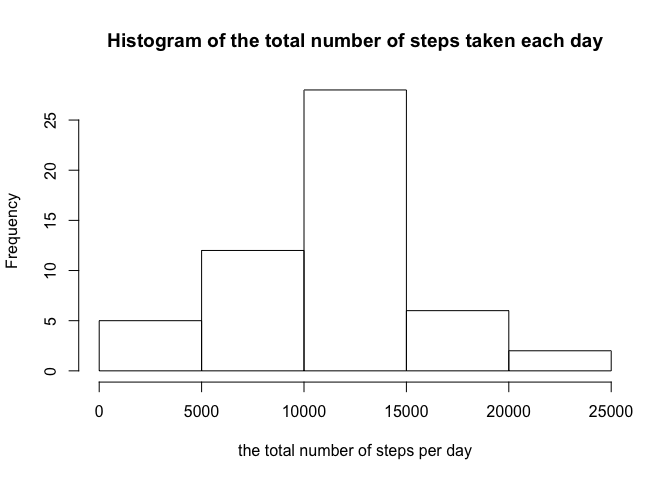
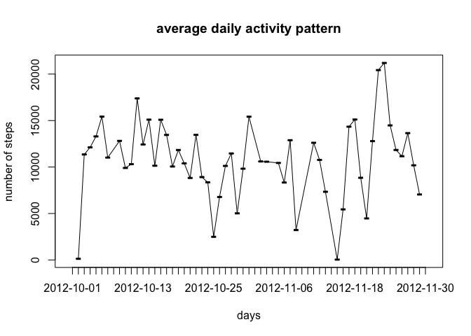
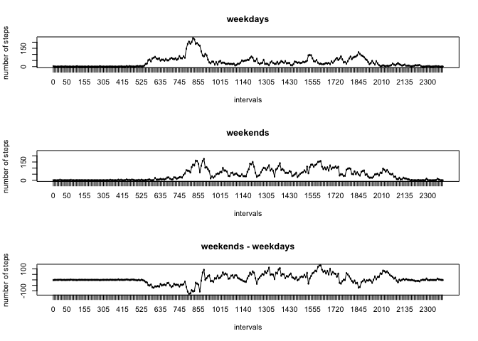

# Reproducible Research: Peer Assessment 1


## Loading and preprocessing the data
The variables included in this dataset are:
steps: Number of steps taking in a 5-minute interval (missing values are coded as NA)
date: The date on which the measurement was taken in YYYY-MM-DD format
interval: Identifier for the 5-minute interval in which measurement was taken

The Code for reading in the dataset and/or processing the data is 

```r
D <- read.csv("activity.csv")
```

## What is mean total number of steps taken per day?
Histogram of the total number of steps taken each day is made here:

```r
totalSteps <- aggregate(D$steps~D$date, FUN=sum)
mean_stepsperday_withmissing <- mean(totalSteps$`D$steps`)
median_stepsperday_withmissing <- median(totalSteps$`D$steps`)

par(mfrow = c(1,1))
hist(totalSteps$`D$steps`,
     xlab = "the total number of steps per day",
     main = "Histogram of the total number of steps taken each day")
```

<!-- -->

The mean number of steps taken each day is 1.0766189\times 10^{4} and 
the median number of steps taken each day is 10765.

## What is the average daily activity pattern?
Time series plot of the average number of steps taken is as following:

```r
plot(totalSteps$`D$date`,totalSteps$`D$steps`,
    main = "average daily activity pattern",
     xlab = 'days',
     ylab = 'number of steps')
lines(totalSteps$`D$date`,totalSteps$`D$steps`,type = "l")
```

<!-- -->


The 5-minute interval that, on average, contains the maximum number of steps is 835.

## Imputing missing values
Code to describe and show a strategy for imputing missing data
The missing data is removed from the aggregated data set using "na.rm=TRUE".
Histogram of the total number of steps taken each day after missing values are imputed.

```r
total_missing_data <- table(is.na(D$steps))[[2]]
totalSteps <- aggregate(D$steps~D$date, FUN=sum, na.rm=TRUE)

Dnona <- subset(D,is.na(D$steps) == FALSE)

mean_stepsperday_withoutmissing <- mean(totalSteps$`D$steps`)
median_stepsperday_withoutmissing <- median(totalSteps$`D$steps`)

mean_stepsperday <- mean(totalSteps$`D$steps`)

hist(totalSteps$`D$steps`,
     xlab = "the total number of steps per day",
     main = "Histogram of the total number of steps taken each day")
```

<!-- -->

The total number of missing values in the dataset is 2304 enteries. After removing those, the mean number of steps taken each day is 1.0766189\times 10^{4} and the median number of steps taken each day is 10765.
The difference in mean is 0, and in the median is 0. I guess by using mean, median, or sum, we already removed the missing data from the data set. Therefore, no change was made after explicitely removing the missing ones.

## Are there differences in activity patterns between weekdays and weekends?

For the panel plot comparing the average number of steps taken per 5-minute interval across weekdays and weekends, we first separate the days into weekends or weekdays, and add that info on the dataset. Then, make a dataset for weekends and weekdays.

We see more steps during early intervals of weekdays than weekends, and more steps during late intervals of weekends than weekdays.


```r
D$weekday <- weekdays(as.Date(D$date,"%Y-%m-%d"))
D$weekend <- (D$weekday == "Sunday" | D$weekday == "Saturday" )

weekends <- subset.data.frame(D,D$weekend == TRUE, select = c('steps', 'interval'))
weekdays <- subset.data.frame(D,D$weekend == FALSE,select = c('steps', 'interval'))

weekends_agg <- aggregate(weekends$steps~as.factor(weekends$interval), FUN=mean, na.rm=TRUE)
weekdays_agg <- aggregate(weekdays$steps~as.factor(weekdays$interval), FUN=mean, na.rm=TRUE)
# table(weekdays_agg$`as.factor(weekdays$interval)`== weekends_agg$`as.factor(weekends$interval)`)
diff_agg <- weekends_agg$`weekends$steps` - weekdays_agg$`weekdays$steps`

lowerband <- min(min(weekends_agg$`weekends$steps`),min(weekdays_agg$`weekdays$steps`))
upperband <- max(max(weekends_agg$`weekends$steps`),max(weekdays_agg$`weekdays$steps`))

# weekdays
par(mfrow = c(3,1))
plot(weekdays_agg$`as.factor(weekdays$interval)`,
     weekdays_agg$`weekdays$steps`,
     main = "weekdays",
     xlab = 'intervals',
     ylab = 'number of steps')
lines(weekdays_agg$`as.factor(weekdays$interval)`,
      weekdays_agg$`weekdays$steps`,
      type = "l",
      ylim = c(lowerband,upperband))

# weekends
plot(weekends_agg$`as.factor(weekends$interval)`,
      weekends_agg$`weekends$steps`,
      main = "weekends",
     xlab = 'intervals',
     ylab = 'number of steps',
      ylim = c(lowerband,upperband))
lines(weekends_agg$`as.factor(weekends$interval)`,
      weekends_agg$`weekends$steps`,
      type = "l")

#difference
plot(weekends_agg$`as.factor(weekends$interval)`,
      diff_agg,
      main = "weekends - weekdays",
     xlab = 'intervals',
     ylab = 'number of steps')
lines(weekends_agg$`as.factor(weekends$interval)`,
      diff_agg,
      type = "l")
```

<!-- -->


